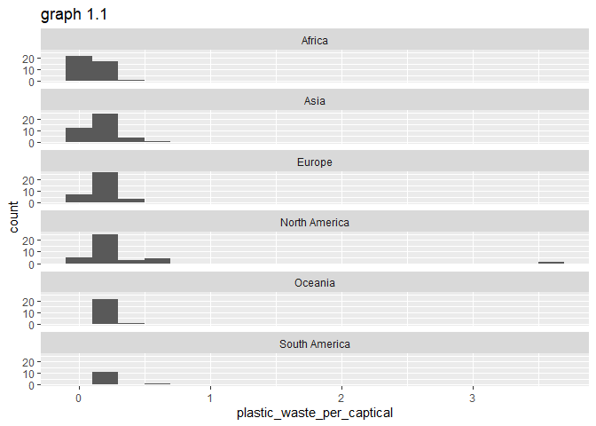

Lab 02 - Plastic waste
================
Insert your name here
Insert date here

## Load packages and data

``` r
library(tidyverse) 
```

``` r
plastic_waste <- read.csv("data/plastic-waste.csv")
```

## Exercises

### Exercise 1

From the graph, it looks like that African has the lowest plastic waste
per capical on average. The distribution of plastic waste per capital
for North America has the greatest variation.

``` r
ggplot(data = plastic_waste, aes(x = plastic_waste_per_cap)) +
 geom_histogram(binwidth = 0.2) +
 labs (x="plastic_waste_per_captical", y="count", title="graph 1.1") +
 facet_wrap(~continent, nrow=7)
```

    ## Warning: Removed 51 rows containing non-finite values (`stat_bin()`).

<!-- -->


    ### Exercise 2


    ```r
    # insert code here

### Exercise 3

Remove this text, and add your answer for Exercise 3 here.

### Exercise 4

Remove this text, and add your answer for Exercise 4 here.

``` r
# insert code here
```

### Exercise 5

Remove this text, and add your answer for Exercise 5 here.

``` r
# insert code here
```

### Exercise 6

Remove this text, and add your answer for Exercise 6 here.

``` r
# insert code here
```

### Exercise 7

Remove this text, and add your answer for Exercise 7 here.

``` r
# insert code here
```

``` r
# insert code here
```

### Exercise 8

Remove this text, and add your answer for Exercise 8 here.

``` r
# insert code here
```

## Pro-Tips

### Excercise 3

Try this :D

ggplot(data = plastic_waste, mapping = aes(x = continent, y =
plastic_waste_per_cap)) + geom_violin()+ geom_boxplot(width=.3,
fill=“green”) + stat_summary(fun.y=median, geom=“point”)

### Exercise 5

Helpful
reference:<http://www.sthda.com/english/wiki/ggplot2-themes-and-background-colors-the-3-elements>
