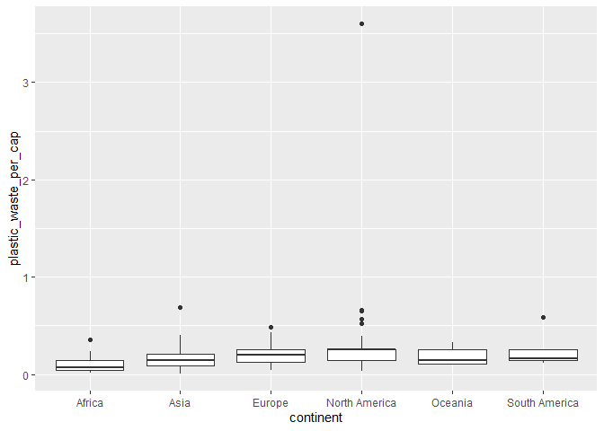
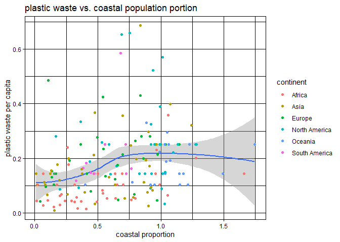

Lab 02 - Plastic waste
================
Insert your name here
Insert date here

## Load packages and data

``` r
library(tidyverse) 
```

``` r
plastic_waste <- read.csv("data/plastic-waste.csv")
```

## Exercises

### Exercise 1

From the graph, it looks like that African has the lowest plastic waste
per capica on average. The distribution of plastic waste per capita for
North America has the greatest variation.

``` r
ggplot(data = plastic_waste, aes(x = plastic_waste_per_cap)) +
 geom_histogram(binwidth = 0.2) +
 labs (x="plastic_waste_per_captical", y="count", title="graph 1.1") +
 facet_wrap(~continent, nrow=7)
```

    ## Warning: Removed 51 rows containing non-finite values (`stat_bin()`).

<!-- -->


    ### Exercise 2


    ```r
    ggplot(data = plastic_waste, 
         mapping = aes(x = plastic_waste_per_cap, 
                      color = continent, 
                      fill = continent)) +
      geom_density(alpha = 0.3)

    ## Warning: Removed 51 rows containing non-finite values (`stat_density()`).

<!-- -->

### Exercise 3

Color and the fill can be specified by the name of the color, like
“red”. but the alpha refers to the transparency of all the colors that
is presented in the graph.

### Exercise 4

violin plots also shows the density of each category. The botplots
emphasize some extreme values which can not be directly seen in the
violin plots.

``` r
ggplot(data = plastic_waste, 
      mapping = aes(x = continent, 
                    y = plastic_waste_per_cap)) +
    geom_violin()
```

    ## Warning: Removed 51 rows containing non-finite values (`stat_ydensity()`).

<!-- -->

``` r
ggplot(data = plastic_waste, 
      mapping = aes(x = continent, 
                    y = plastic_waste_per_cap)) +
   geom_boxplot()
```

    ## Warning: Removed 51 rows containing non-finite values (`stat_boxplot()`).

<!-- -->

### Exercise 5

4.1. a slight positive correlation between mismanaged waste per capita
and waste per capital.

``` r
 ggplot(data = plastic_waste, 
       mapping = aes(x = mismanaged_plastic_waste_per_cap,
                     y = plastic_waste_per_cap)) +
    geom_point()
```

    ## Warning: Removed 51 rows containing missing values (`geom_point()`).

<!-- -->

### Exercise 6

4.2. It helps to visualize difference among continents and distinguish
the correlation for each continent, but the points are still very
concentrated and hard to look at.

``` r
ggplot(data = plastic_waste, 
       mapping = aes(x = mismanaged_plastic_waste_per_cap, 
       y = plastic_waste_per_cap,color = continent,fill = continent)) +
   geom_point()
```

    ## Warning: Removed 51 rows containing missing values (`geom_point()`).

<!-- -->

### Exercise 7

coastal population has slightly negative relationship with plastic waste
per capita. Total population and plastic waste per capita has weaker
associations in general. None of the pairs of variables appear to be
storngly linearly associated.

``` r
 ggplot(data = plastic_waste, 
        mapping = aes(x = total_pop, 
                     y = plastic_waste_per_cap,color = continent,fill = continent)) +
                     geom_point()
```

    ## Warning: Removed 61 rows containing missing values (`geom_point()`).

<!-- -->

``` r
ggplot(data = plastic_waste, 
      mapping = aes(x = coastal_pop, 
                     y = plastic_waste_per_cap, color = continent,fill = continent)) +
   geom_point()
```

    ## Warning: Removed 51 rows containing missing values (`geom_point()`).

<!-- -->

### Exercise 8

``` r
data <- plastic_waste %>%
filter(plastic_waste_per_cap < 3)
y <- as.numeric(plastic_waste$coastal_pop/plastic_waste$plastic_waste_per_cap)
ggplot(data = plastic_waste, 
       mapping = aes(x = coastal_pop,
                     y = plastic_waste_per_cap, color = continent,fill = continent)) +
                  labs (x = "coastal population", y = "plastic waste per capita", title = "plastic waste vs. coastal population portion", fill = "continent") + 
 stat_smooth(size=1, alpha=0.4) +
 geom_point()
```

    ## Warning: Using `size` aesthetic for lines was deprecated in ggplot2 3.4.0.
    ## ℹ Please use `linewidth` instead.

    ## `geom_smooth()` using method = 'loess' and formula = 'y ~ x'

    ## Warning: Removed 51 rows containing non-finite values (`stat_smooth()`).

    ## Warning: Removed 51 rows containing missing values (`geom_point()`).

<!-- -->

## Pro-Tips

### Excercise 3

Try this :D

ggplot(data = plastic_waste, mapping = aes(x = continent, y =
plastic_waste_per_cap)) + geom_violin()+ geom_boxplot(width=.3,
fill=“green”) + stat_summary(fun.y=median, geom=“point”)

### Exercise 5

Helpful
reference:<http://www.sthda.com/english/wiki/ggplot2-themes-and-background-colors-the-3-elements>
